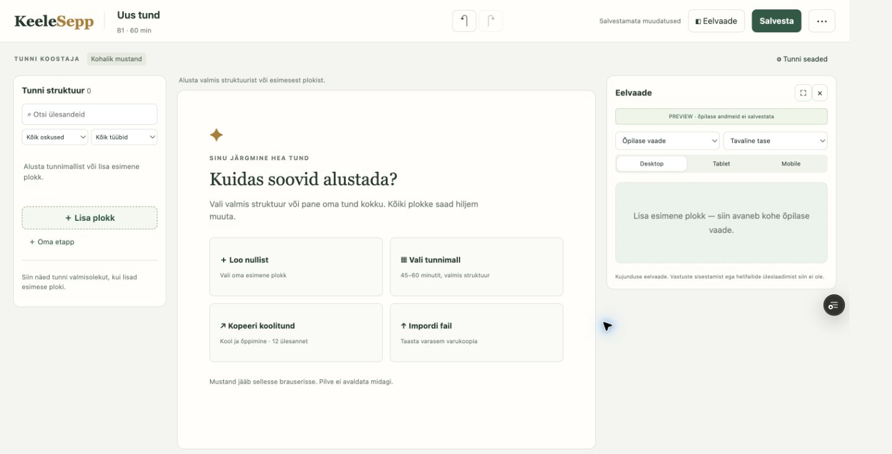
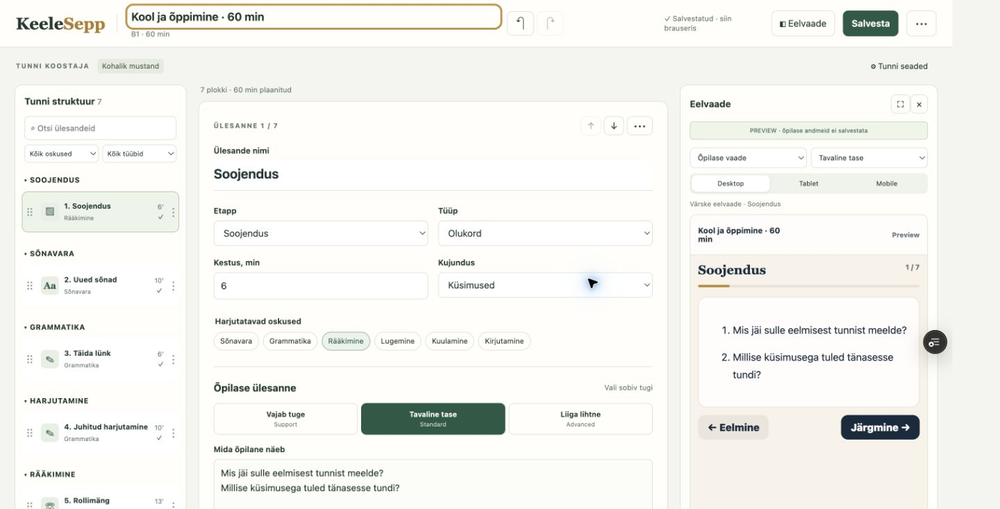
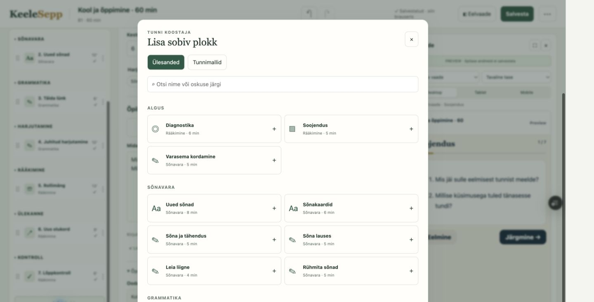
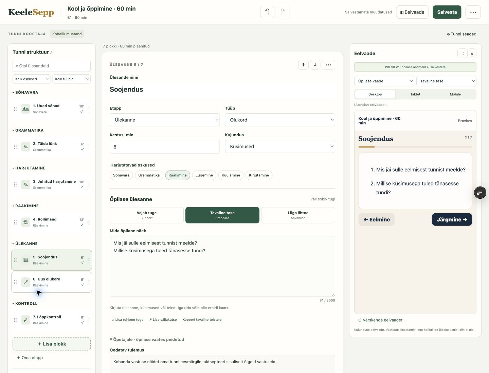
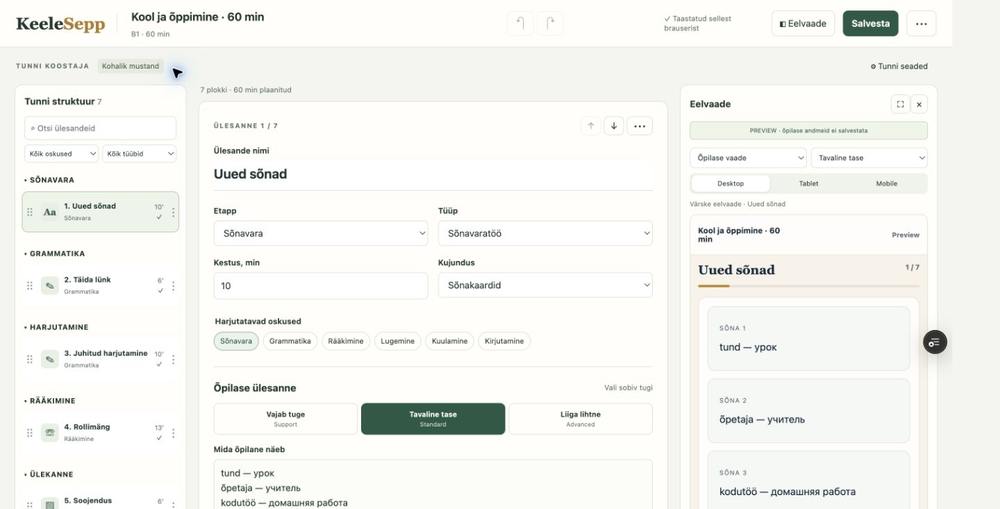
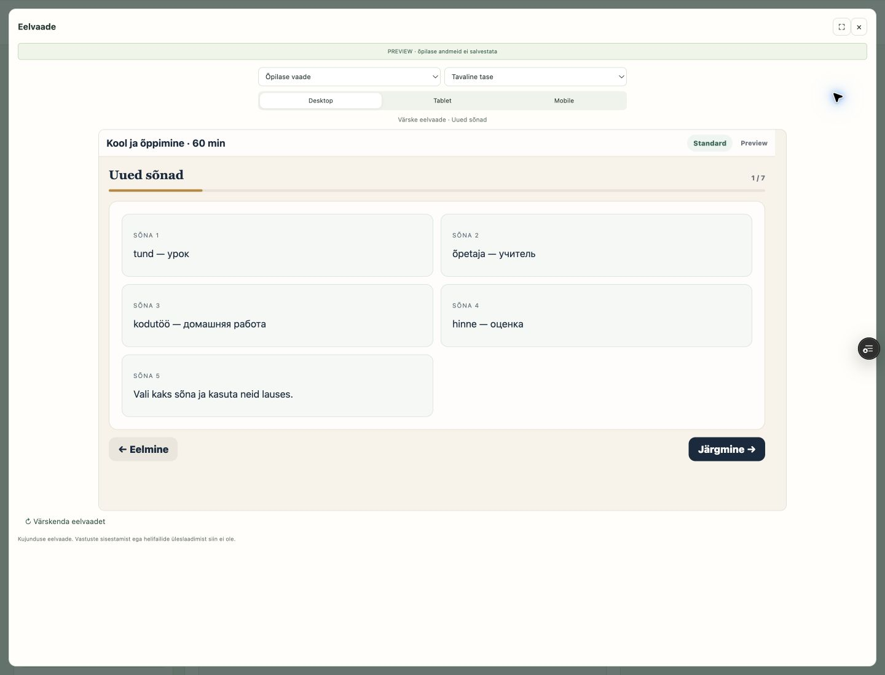
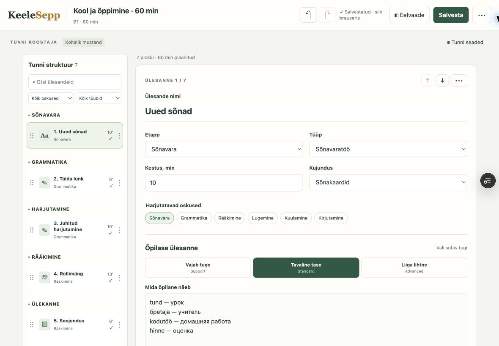
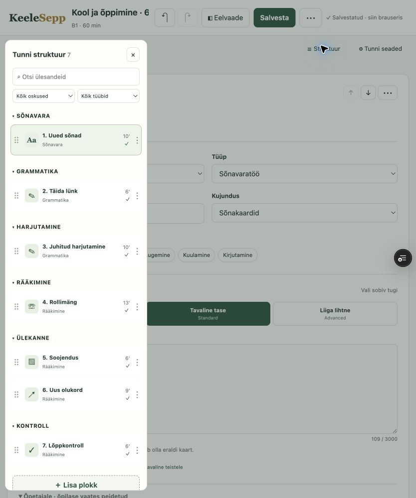

# PR #100 visual review

Production screenshot supplied by the owner shows the merged #99 form. These screenshots are from the unmerged #100 automatic Vercel preview, captured in real Chrome on 2026-09-07. No production deployment.

[Open the actual PR #100 preview](https://keelesepp-git-agent-lesso-6ab58d-zakutailopavel-cybers-projects.vercel.app/haldus-lesson-builder/).

UX pass: per-card actions menu, human difficulty labels, inline validation, template library, hidden technical information. Empty preview now explains the next action instead of claiming a validation error.

Visual pass: three desktop columns, centered device frames, compact card actions, consistent hover/focus states, laptop two-column layout and tablet structure drawer.

The drag image records the result of an actual pointer operation, not a staged insertion indicator. Insertion indicator behavior is additionally covered by the DOM drag test.

450 tests pass; console errors/warnings absent. Manual JSON file upload roundtrip/malformed-file checks remain blocked by browser-extension file access; not claimed complete.

## Empty / start screen

## 60-minute lesson template selected

## Block library

## After real pointer drag: first activity moved to fifth, across phases

## Activity editor with live student preview

## Fullscreen live preview

## Laptop — 1180px

## Tablet — 834px with structure drawer

